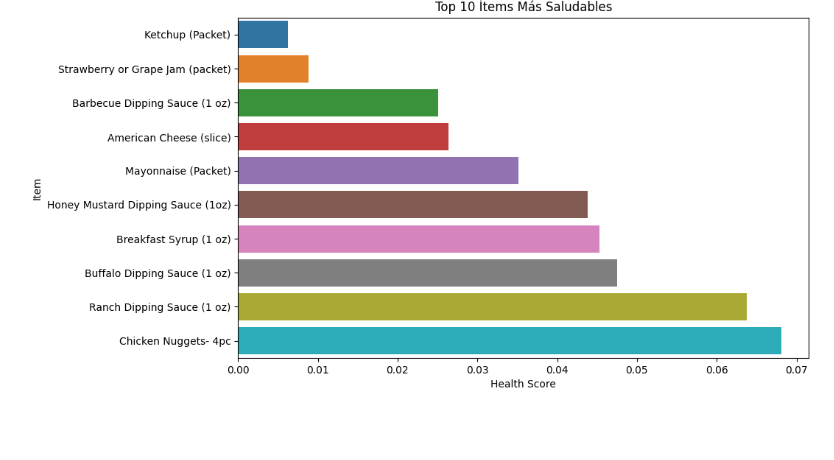
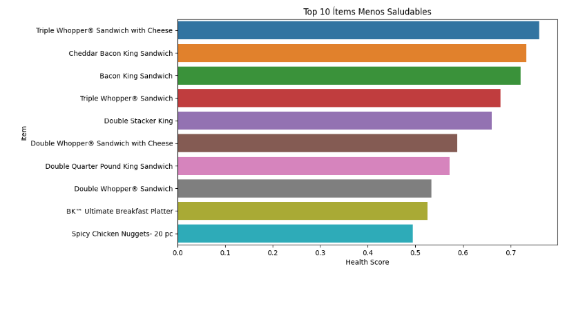

<h1 align="center">📊 Análisis Nutricional del Menú de Burger King 🍔</h1>

  

## Descripción
Este proyecto analiza la información nutricional de los principales ítems del menú de Burger King, ayudando a identificar las opciones más saludables y menos saludables utilizando Data Science.

## Resultados Clave

- Los ítems más saludables incluyen opciones como...
  
-68                   Ketchup (Packet)      
-70   Strawberry or Grape Jam (packet)      
-72      Barbecue Dipping Sauce (1 oz)      
-67            American Cheese (slice)      
-69                Mayonnaise (Packet)      
-76  Honey Mustard Dipping Sauce (1oz)     
-71             Breakfast Syrup (1 oz)    
-74       Buffalo Dipping Sauce (1 oz)      
-73         Ranch Dipping Sauce (1 oz)      
-40               Chicken Nuggets- 4pc    

  
- Los ítems menos saludables incluyen...

                                    
-6   Triple Whopper® Sandwich with Cheese     
-9            Cheddar Bacon King Sandwich     
-8                    Bacon King Sandwich     
-5               Triple Whopper® Sandwich      
-13                   Double Stacker King     
-4   Double Whopper® Sandwich with Cheese      
-11    Double Quarter Pound King Sandwich      
-3               Double Whopper® Sandwich     
-59        BK™ Ultimate Breakfast Platter     
-36          Spicy Chicken Nuggets- 20 pc     

## Capturas de Pantalla

   

   

